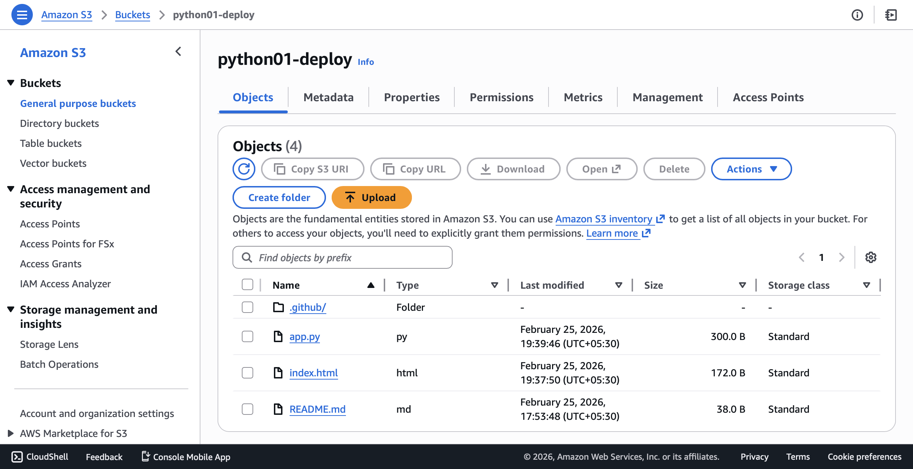
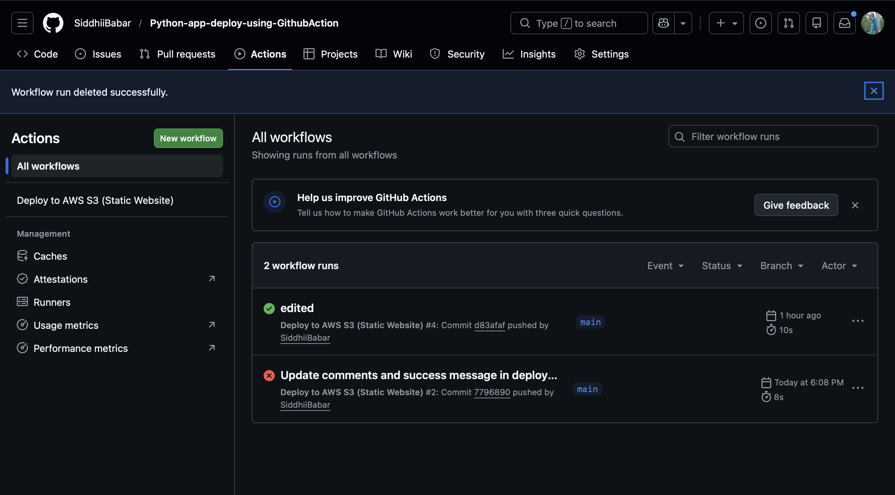
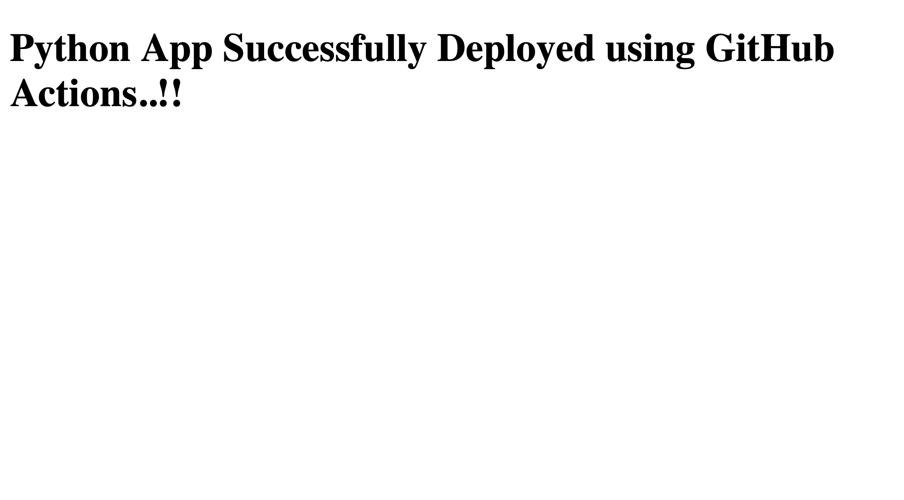

# 🚀 Python App Deployment using GitHub Actions

This project demonstrates **CI/CD automation using GitHub Actions** to deploy a Python application to **AWS S3**.

---

## 📌 Project Overview

In this project, whenever code is pushed to the GitHub repository, a **GitHub Actions pipeline** is triggered automatically which deploys the Python application to an **AWS S3 bucket**.

This setup helps achieve **continuous integration and continuous deployment (CI/CD)**.

---

## 🛠️ Tech Stack Used

- Python  
- GitHub Actions  
- AWS S3  
- IAM  
- Git & GitHub  

---

## ⚙️ CI/CD Workflow

1. Developer pushes code to GitHub  
2. GitHub Actions pipeline starts automatically  
3. Workflow installs dependencies  
4. Application is deployed to AWS S3  

---

## 🏗️ Architecture & Flow Diagrams

### 🔹 S3 Deployment Flow

### 🔹 GitHubActions Workflow

### 🔹 Application Output

---

## ✨ Key Features

- Automated CI/CD pipeline  
- Secure AWS authentication using GitHub Secrets  
- Fast & reliable deployment  
- Beginner-friendly DevOps project  

---

## 🎯 Learning Outcomes

- Hands-on experience with GitHub Actions  
- CI/CD pipeline implementation  
- AWS S3 deployment  
- IAM security best practices  
- Real-world DevOps workflow understanding  

---
## 👩‍💻 Author

**Siddhi Babar**  

📧 Email: *(sidhhibabar93@gmail.com)*  
🔗 GitHub: https://github.com/SiddhiiBabar/

